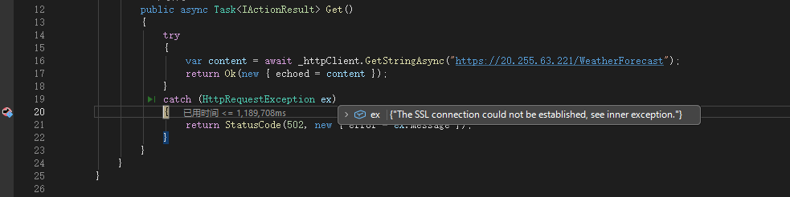
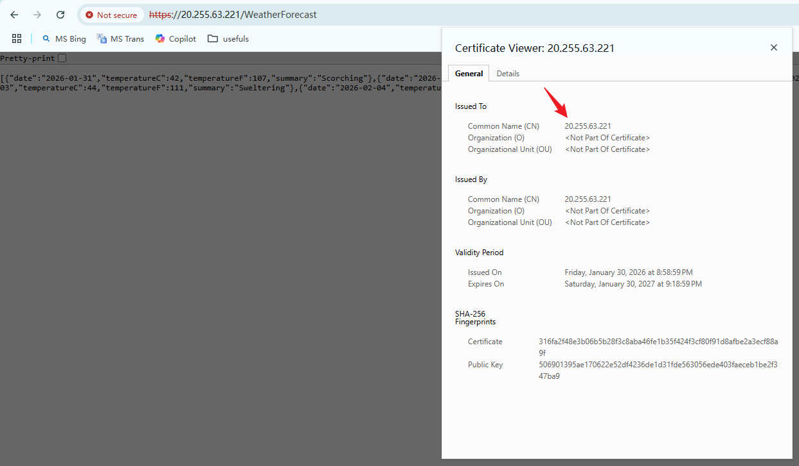
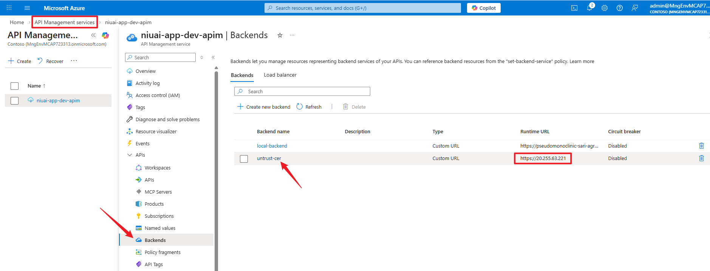
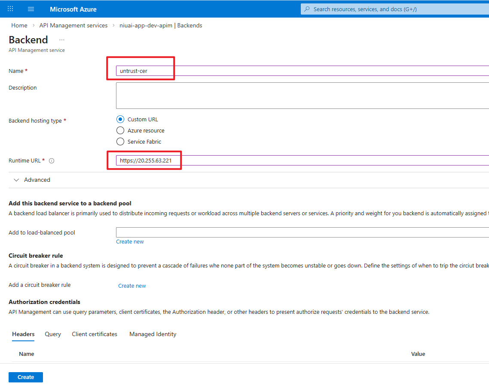
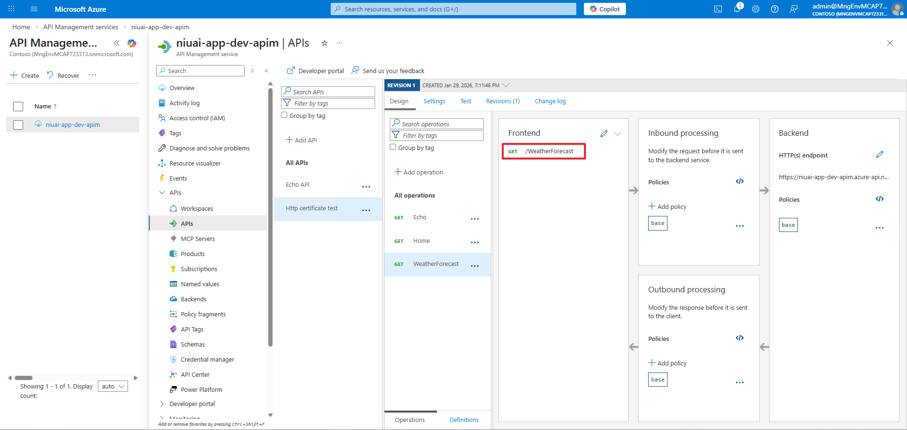
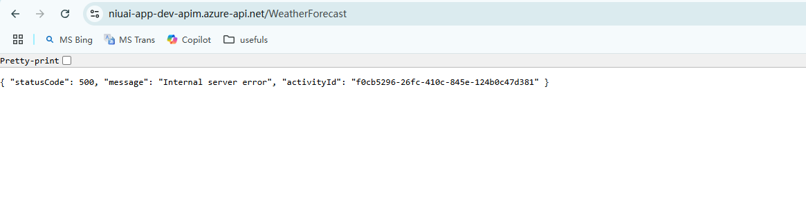
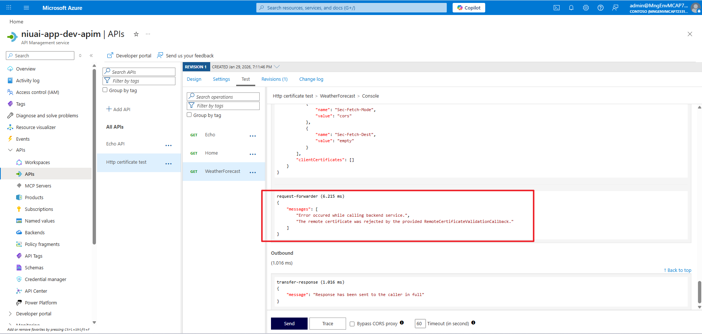
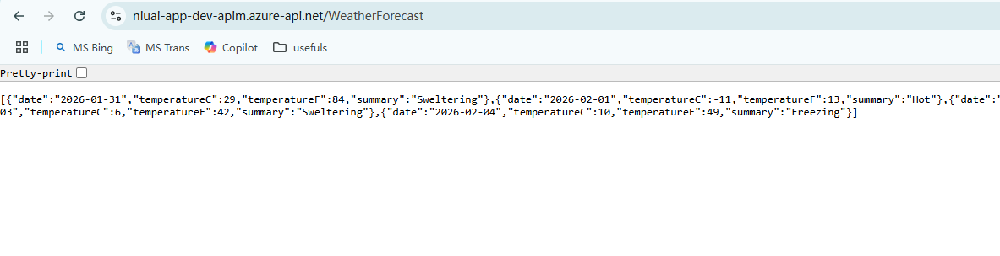

## 背景

IIS + 自签名 HTTPS 证书，不被客户端调用方（App Service）信任，导致请求报错：“The SSL connection could not be established, see inner exception.”

如果通过浏览器直接访问，会有【Not secure】的标志（表明当前链接不是安全的）

## 解决方案：APIM + 自签名证书

### 使用/创建 Azure APIM 资源

创建 backend，并配置 IIS 的域名（本例中为 IP，实际上请配置为您的域名）

配置界面

- Name：填写任意名称即可
- Runtime URL：填写 IIS 的公网地址（此处演示为：<https://20.255.63.221>，根据您的实际情况填写）

### 添加/配置 APIM 的 API（frontend + backend）
先在 API 下的【All operations】配置 backend，通过点击 “Policies” 进入（也可以单独为各个api配置），加入以下配置：`<set-backend-service backend-id="untrust-cer" />`。注意 `backend-id` 填入上一步配置的 backend 名称

此时，该 API 组下的单个 api，会自动继承该配置。添加一个单独的 api，使其指向 IIS 的对外 API `/WeatherForecast`

在未导入私有的自签名证书前，通过 APIM 是无法将客户调用转发到 IIS 的 `/WeatherForecast` API 的（报错如下）

此时，进到 APIM 的 api test 能看到是因为证书的原因

### 解决方案

将自签名证书（.cer）导入 APIM
> 注意：若服务器证书有根证书、中间证书，需要将其都上传到 APIM 的证书中。参考：<https://docs.azure.cn/zh-cn/api-management/api-management-howto-ca-certificates>

最后，就可以通过 APIM 将用户的请求传递到 IIS 了。当然，通过 App Service 去调用也是 OK 的（需要注意调用地址改成 APIM 的地址了 - `https://niuai-app-dev-apim.azure-api.net/WeatherForecast`）

