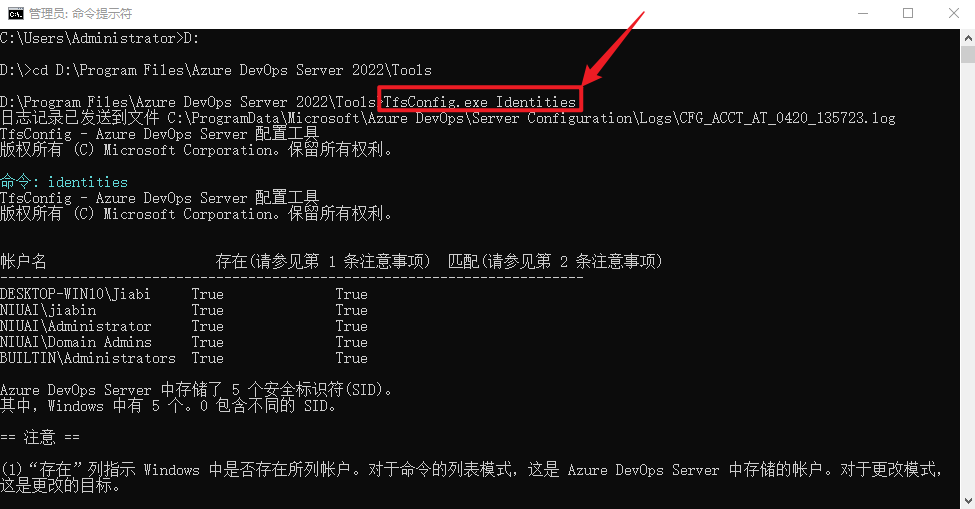
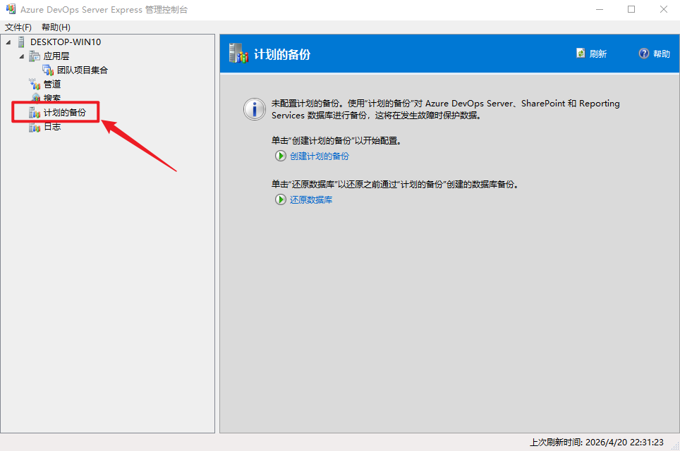
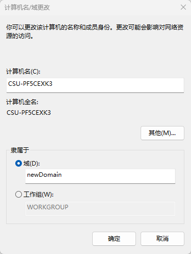

## Azure DevOps Server 跨域迁移操作步骤

> 参考官方文档：[Move from one environment to another for Azure DevOps on-premises（跨域/跨环境迁移）](https://learn.microsoft.com/en-us/azure/devops/server/admin/move-across-domains?view=azure-devops-server)

### 0. 迁移前准备

1. 使用**专用迁移管理员账号**登录（不要使用将被迁移的账号）。
2. 确认该账号具备以下权限：
	- Azure DevOps Server：Team Foundation Administrators、Admin Console Users
	- SQL Server：`sysadmin`
	- 服务器本地：Administrators
3. 梳理身份映射表（建议提前做成表格）：
	- 旧域账号 -> 新域账号
	- 服务账号（AT、Reporting、Proxy）
	- 同名可批量迁移账号、异名需单独迁移账号（本次环境不存在异名账号）
    
进入到 AT 的安装目录，%ProgramFiles%/Azure DevOps Server 2022/Tools（实际可从 administration console 的目录查看），以管理员方式执行以下命令：
```bat
TFSConfig Identities
```


4. 将“需要迁移”的账号从应用层服务器本地 Administrators 组中移除，避免自动注入导致冲突。（注意：若有多个 AT，则需在每个实例上操作）
5. 检查输出中是否存在目标域同名/冲突身份，提前处理冲突后再继续。

---

### 1. 停止服务

1. 在应用层服务器打开管理员命令行，进入 `Tools` 目录。
2. 执行（若有多个 AT，则每个 AT 都需执行）：

```bat
TFSServiceControl quiesce
```

3. 执行后 Portal 进入维护态，确认用户无法继续提交代码/修改工作项后，进入下一步。

---

### 2. 完整备份（数据库 + 报表密钥）

1. 打开 Azure DevOps Server 管理控制台 -> Scheduled Backups。
2. 立即执行一次 Full Backup（若之前未设置过备份计划，需要先进行配置）。
3. 如果启用了 Reporting，务必包含 SQL Server Reporting Services 加密密钥。
4. 备份完成后，确认备份文件在共享路径可访问，并可被目标环境读取。



---

### 3. 服务器加入新域

1. 对涉及的服务器（至少应用层，按需包括数据层/报表层）执行“加入新域”。
2. 使用有域加入权限的账号完成域变更。
3. 重启服务器。



---

### 4. 迁移用户与服务账号（核心步骤）

1. 在应用层服务器管理员命令行进入 `Tools` 目录。
2. 先迁移服务账号 SID（示例）：

```bat
TFSConfig Identities /change /fromdomain:OldDomain /todomain:NewDomain /account:OldTFSServiceAccount /toaccount:NewTFSServiceAccount
```

3. 对“旧域与新域**同名**账号”执行批量映射：

```bat
TFSConfig Identities /change /fromdomain:OldDomain /todomain:NewDomain
```

4. 对“新旧域账号名不同”的身份逐个映射：

```bat
TFSConfig Identities /change /fromdomain:OldDomain /todomain:NewDomain /account:OldUser /toaccount:NewUser
```

5. 更新应用层服务账号密码：

```bat
TFSConfig Accounts /change /AccountType:ApplicationTier /account:NewDomain\SvcAdo /password:***
```

6. 如使用 Reporting，更新报表数据源账号：

```bat
TFSConfig Accounts /change /AccountType:ReportingDataSource /account:NewDomain\SvcRpt /password:***
```

7. 如使用 Proxy，更新 Proxy 服务账号：

```bat
TFSConfig Accounts /change /AccountType:Proxy /account:NewDomain\SvcProxy /password:***
```

8. 对于无效账号（在老域中有但可能离职、失效的账号，在新域中不存在的账号），需要从 Security Scope 中移除（若不及时清除，即使迁移成功，也会造成性能逐渐恶化）

> 注意：系统账号（如 `Network Service`）不能按普通账号直接迁移，需按官方 Identities Command 说明采用分阶段处理。

---

### 5. 配置 Reporting/Analysis（仅启用报表时）

1. 打开 Azure DevOps Server 管理控制台 -> Reporting。
2. 若报表服务器名称变化，更新 3 个页签中的服务器地址与账号。
3. 点击 Start Jobs。
4. 点击 Start Rebuild，重建 Warehouse/Analysis。

---

### 6. 重新配置备份计划

1. 在 Scheduled Backups 中更新新域下的共享路径/存储路径。
2. 重新保存计划并触发一次测试备份。

---

### 7. 恢复服务

1. 在各个 AT 服务器管理员命令行进入 `Tools` 目录。
2. 执行：

```bat
TFSServiceControl unquiesce
```

3. 确认服务恢复正常。

---

### 8. 迁移后验证

1. 随机抽查 3~5 个项目：代码拉取、提交、PR、工作项读写正常。
2. 校验构建/发布代理与服务连接（Git、TFVC、Feed、Service Connection）。
3. 验证报表与分析数据刷新正常（如启用）。
4. 检查应用层事件日志、作业历史、SQL 连接错误。
5. 用 `TFSConfig Identities` 再次核对关键用户和服务账号是否已映射到新域 SID。

---

### 9. 迁移失败回退（从备份数据库还原）

> 触发条件建议：Portal 无法访问、关键集合不可用、身份映射大量失败且短时间无法修复。

1. 在所有 AT 上再次执行停服，避免产生新的写入：

```bat
TFSServiceControl quiesce
```

2. 在 SQL Server 上停止与 Azure DevOps 相关的连接活动（必要时临时停止 AT 服务）。
3. 使用步骤 #2 生成的 Full Backup，按原库名还原所有 Azure DevOps 数据库（配置库、集合库、仓库相关库）。
4. 如启用了 Reporting，同步还原 Reporting 相关数据库，并在 SSRS 中恢复加密密钥。
5. 确认 SQL 还原完成且数据库状态为 Online，账号权限恢复到迁移前配置。
6. 在 AT 服务器打开 Azure DevOps 管理控制台，确认实例、集合、服务连接信息正常。
7. 执行服务恢复：

```bat
TFSServiceControl unquiesce
```

8. 执行最小化业务验证：Portal 登录、任一项目读写、构建队列、工作项查询。
9. 宣布回退完成，并冻结本次迁移变更，保留日志用于下一窗口复盘。

---

## 常见风险与控制

1. 不要把“硬件迁移”和“域迁移”混做一次变更。
2. 目标域若已有同名身份记录，`TFSConfig Identities` 可能失败；必须先清理冲突。
3. 迁移窗口内必须保持源环境冻结（`quiesce` 到 `unquiesce` 期间禁止写入）。

