## 1. Create a Storage Account (Container) in Azure

> Note: The Storage must be reachable by the GitHub platform (it can be publicly accessible or whitelisted for GitHub).

Create a Container to store GitHub Enterprise logs (for example: `github-audit-log`), then click the container's "..." and generate a SAS access link.

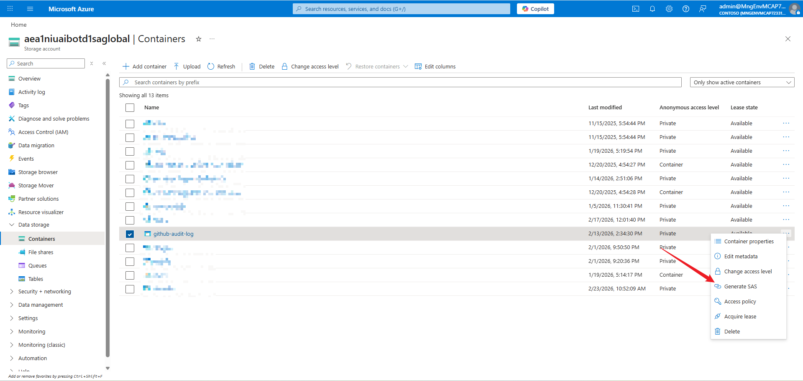

Set the SAS link expiration to one year (or configure as needed) and keep other settings at their defaults. Click "Generate SAS token and URL" and copy the generated Blob SAS URL (you will configure this in GitHub later).

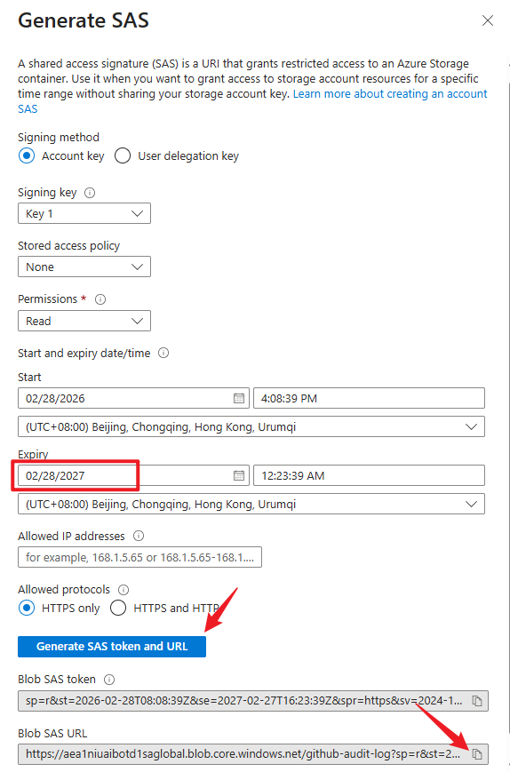

## 2. Configure GitHub Audit Log Stream

Go to GitHub Enterprise Settings -> Audit log -> Log streaming, click "Configure stream -> Azure Blob Storage" to add a new configuration.

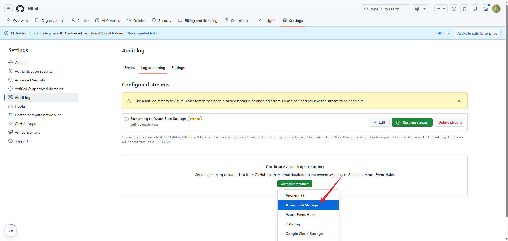

Fill in the Azure Storage information you created earlier and save.

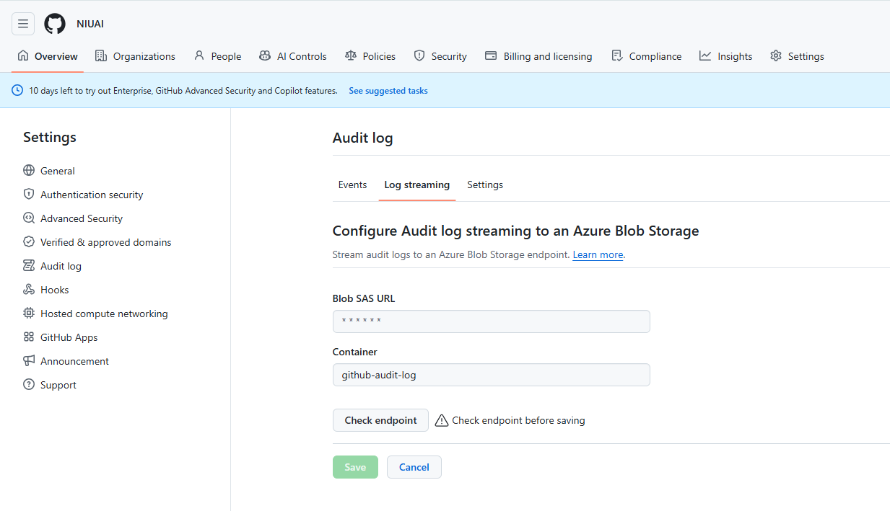

At this point, GitHub platform logs will be pushed in near real-time (delay: minutes) to the specified Azure Storage (Container). Next, configure ELK to pull these logs in real time.

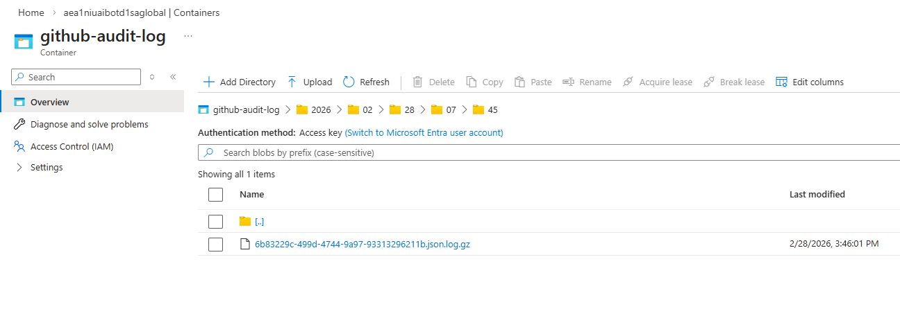

## 2. Configure ELK to periodically pull Azure Container (GitHub Enterprise) logs

In ELK's "Integrations", install the "Custom Azure Blob Storage Input" integration.

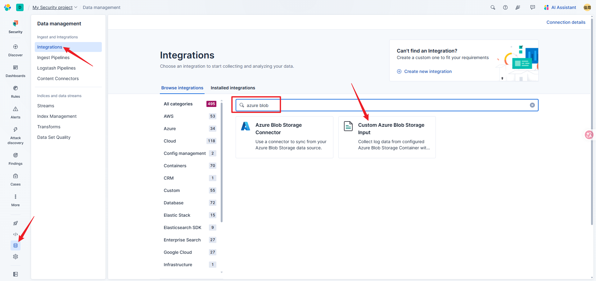

Then configure it — pay attention to the following values:

- **Account Name**: enter the Azure Storage account name
- **Service Account Key**: enter the Azure Storage account key
- **Dataset name**: enter `github.audit` (you can change this if desired)
- **Containers**: YAML format — set `name` to the container you created earlier (`github-audit-log`)
- **File Selectors**: YAML format — set `regex` to the log files you want to collect (here set to `".*"`)

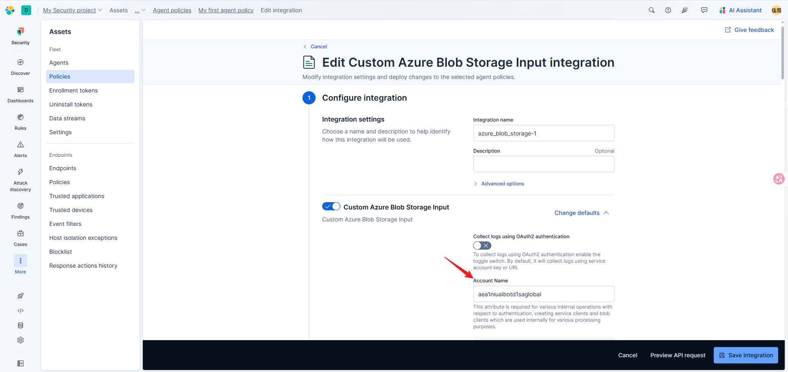

Then click Save.

Install an Agent (the Agent performs the log collection and must be able to reach the Azure Container). Run the provided install script on a prepared physical or virtual machine. After installation you should see the Agent status in the ELK UI.

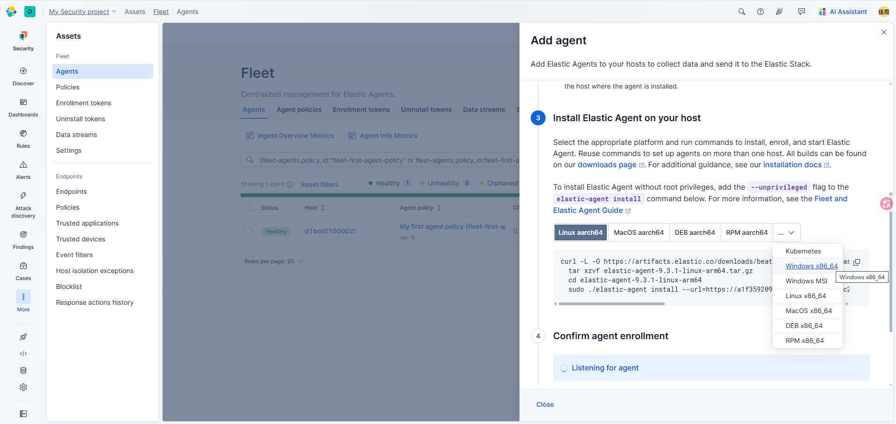
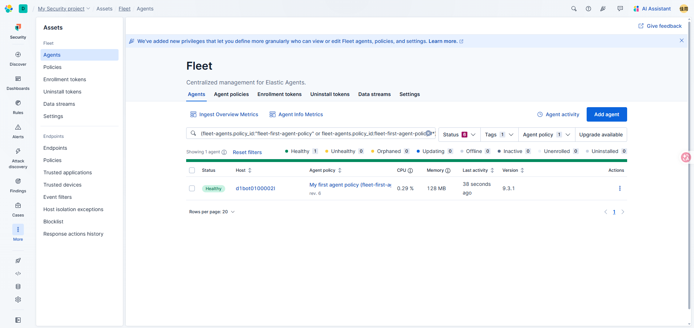

## 3. View GitHub Audit Logs in ELK

Go to Discover, open the Data view dropdown in the top-left, and click "Create a data view" to create a view for the GitHub audit logs.

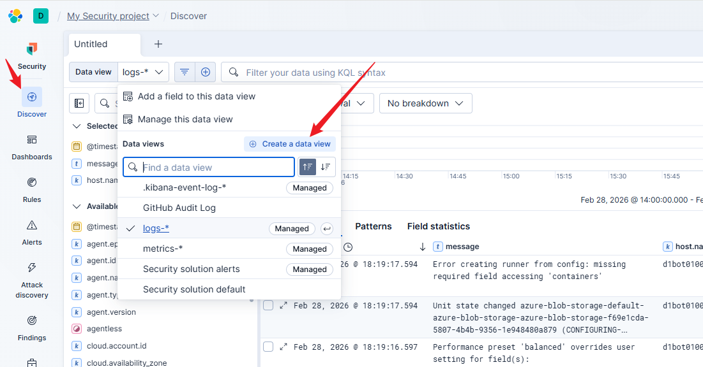

Configure the data view as shown below (note: the previous steps must be completed so the index is available to configure).

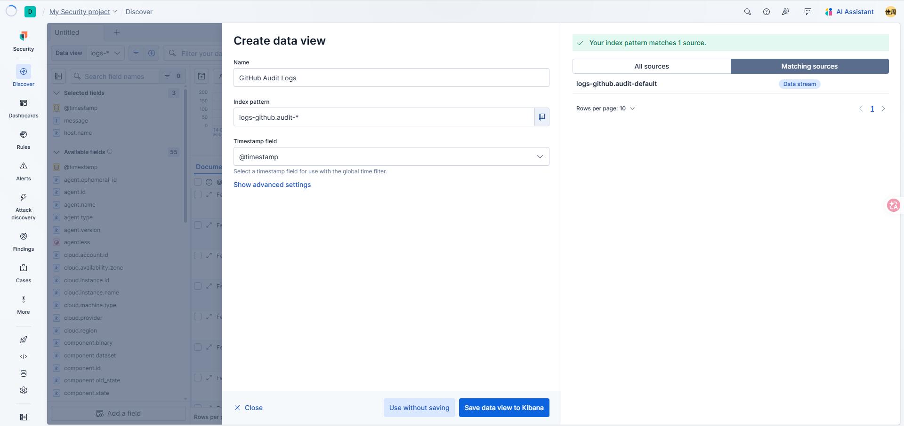

After saving, you can view the GitHub Audit Log in Discover.

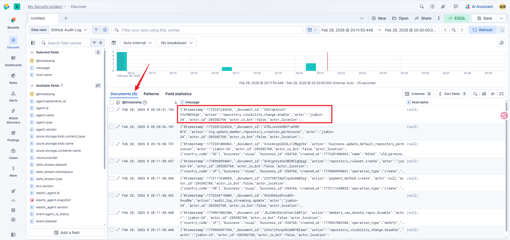

